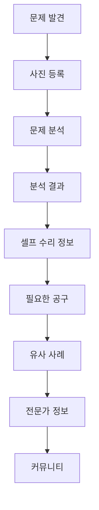

# 🏠 HOME SURI HOME — AI Self Home Repair

> **사진 한 장으로 집수리가 쉬워진다.**  
> AI 사진 분석을 기반으로 집 안의 문제를 파악하고, 셀프 수리 방법부터 필요한 공구·구매처·전문가 연결까지 이어지는 AI 셀프 집수리 모바일 웹앱입니다.


**Project Type** · 개인 포트폴리오 / 모바일 웹앱  
**Creator** · 장혜리  
**Repository** · https://github.com/hrjang95-code/homesurihome

---

## 🖼️ Demo

현재 프로젝트는 GitHub 저장소를 기준으로 관리하고 있습니다.

- GitHub Repository: https://github.com/hrjang95-code/homesurihome
- Mobile-first Web App
- React + Vite + TypeScript 기반 구조

> 본 프로젝트는 포트폴리오 및 학습 목적으로 제작한 개인 프로젝트입니다.  
> 실제 상용 AI 분석 서비스가 완전히 연동된 제품으로 소개하지 않으며, 사용자 흐름과 모바일 UI 구현을 중심으로 제작했습니다.

---

## 📌 Project Overview

**HOME SURI HOME**은 집에서 발생하는 작은 고장이나 수리 문제를 사용자가 보다 쉽게 이해하고 해결할 수 있도록 기획한 AI 기반 셀프 집수리 모바일 웹앱 프로젝트입니다.

사용자가 수리가 필요한 부분의 사진을 등록하면 문제를 분석하는 흐름을 중심으로 구성하고, 이후 셀프 수리 정보, 필요한 공구, 구매 흐름, 유사 사례, 전문가 정보, 커뮤니티까지 자연스럽게 이어지도록 사용자 경험을 설계했습니다.

초기에는 HTML / CSS / JavaScript 기반 퍼블리싱 형태로 작업했으며, 이후 프로젝트 구조와 화면 관리를 개선하기 위해 **React + Vite + TypeScript** 구조로 전환했습니다.

---

## 💡 Background

집 안에서 갑자기 수리 문제가 발생하면 사용자는 다음과 같은 어려움을 겪을 수 있습니다.

- 어디가 문제인지 정확히 판단하기 어렵다.
- 직접 고칠 수 있는 문제인지 알기 어렵다.
- 어떤 공구와 부품이 필요한지 찾기 어렵다.
- 검색 결과가 많아 적절한 해결 방법을 고르기 어렵다.
- 전문가의 도움이 필요한 경우 어디에 요청해야 할지 고민된다.

HOME SURI HOME은 이러한 문제 해결 과정을 여러 서비스에서 따로 찾는 대신, 하나의 모바일 흐름 안에서 이해하기 쉽게 연결하는 것을 목표로 기획했습니다.

---

## ✨ 주요 기능 & 화면

### 01. Login

앱 진입을 위한 로그인 화면입니다.  
React 구조 전환 이후 로그인 화면에서도 공통 `BottomNavigation`이 노출되는 문제를 수정하면서 페이지별 레이아웃 분리 기준을 정리했습니다.

### 02. Home

서비스의 주요 기능과 다음 행동으로 자연스럽게 이동할 수 있도록 구성한 메인 화면입니다.  
모바일 우선의 카드형 UI를 기반으로 주요 기능에 빠르게 접근할 수 있도록 설계했습니다.

### 03. 문제 사진 등록

집 안에서 문제가 발생한 부분의 사진을 등록하는 화면입니다.  
사용자가 복잡한 입력 없이 사진을 중심으로 문제 해결 과정을 시작할 수 있도록 구성했습니다.

### 04. 분석 결과

등록한 문제에 대한 분석 결과를 확인하는 화면입니다.  
문제의 상태를 이해하고 이후 셀프 수리 또는 추가 정보 탐색으로 이어질 수 있도록 사용자 흐름을 설계했습니다.

### 05. 공구 추천 / Shop

수리에 필요한 공구와 준비물을 확인하는 화면입니다.  
문제 해결에 필요한 다음 행동을 빠르게 이해할 수 있도록 상품 및 공구 정보를 카드 기반 UI로 구성했습니다.

### 06. 유사 수리 사례

비슷한 문제를 겪은 사례를 참고할 수 있도록 구성한 정보 영역입니다.  
사용자가 자신의 상황과 유사한 수리 경험을 확인하고 해결 방향을 판단할 수 있도록 설계했습니다.

### 07. 전문가 정보

셀프 수리가 어렵거나 전문가의 도움이 필요한 상황을 위해 전문가 정보를 확인할 수 있도록 구성했습니다.  
관련 데이터는 `src/data/expertData.ts`에서 관리합니다.

### 08. Community

사용자들이 집수리 경험과 정보를 공유할 수 있도록 기획한 커뮤니티 영역입니다.  
전문적인 수리 정보만 제공하기보다 실제 사용자 경험까지 연결하는 서비스 흐름을 목표로 했습니다.

---

## 🧭 User Flow



텍스트 흐름으로 보면 다음과 같습니다.

**문제 발견 → 사진 등록 → 문제 분석 → 분석 결과 → 셀프 수리 정보 → 필요한 공구 → 유사 사례 → 전문가 → 커뮤니티**

---

## 🎨 Design Concept

HOME SURI HOME은 집수리 서비스가 어렵고 전문적으로만 느껴지지 않도록 **친근함, 간결함, 모바일 사용성**을 중심으로 디자인했습니다.

- **Brown + Ivory** 컬러를 활용한 따뜻한 분위기
- 모바일 화면을 우선한 레이아웃
- 정보를 빠르게 구분할 수 있는 카드 기반 UI
- 친근한 비버 캐릭터를 활용한 브랜드 아이덴티티
- 복잡한 AI 서비스처럼 보이기보다 이해하기 쉬운 화면 구성
- 심플하고 모던한 인터페이스
- 페이지 간 일관된 여백과 컴포넌트 구조 유지

---

## 🗂️ 실제 Folder Structure

아래 구조는 현재 확인된 프로젝트 파일을 기준으로 작성했습니다.

```text
HOME-SURI-HOME/
├── src/
│   ├── components/
│   │   ├── AppLayout.tsx
│   │   ├── BottomNavigation.tsx
│   │   ├── Header.tsx
│   │   ├── ScrollToTop.tsx
│   │   └── ToastContext.tsx
│   │
│   ├── data/
│   │   └── expertData.ts
│   │
│   ├── pages/
│   │   ├── ExpertPage.tsx
│   │   ├── HomePage.tsx
│   │   ├── LoginPage.tsx
│   │   ├── ResultPage.tsx
│   │   ├── ScanPage.tsx
│   │   └── ShopPage.tsx
│   │
│   ├── styles/
│   │   ├── common.css
│   │   └── expert.css
│   │
│   ├── App.tsx
│   └── main.tsx
│
├── original-design/
├── Publishing/
├── index.html
├── package.json
├── package-lock.json
├── tsconfig.json
└── vite.config.ts
```

### 폴더 구성 정리

- `components/` : 여러 페이지에서 공통으로 사용하는 UI 및 레이아웃 컴포넌트
- `pages/` : 로그인, 홈, 사진 등록, 결과, Shop, 전문가 등 주요 화면
- `data/` : 전문가 관련 데이터
- `styles/` : 공통 스타일 및 페이지 단위 스타일
- `original-design/` : 기존 디자인 관련 파일
- `Publishing/` : 기존 퍼블리싱 작업 관련 파일

---

## 🛠️ Tech Stack

| 기술 | 사용 목적 |
|---|---|
| **React** | 화면을 페이지와 컴포넌트 단위로 분리하고 UI 상태를 구조적으로 관리 |
| **Vite** | React + TypeScript 개발 환경 구성 및 빠른 로컬 개발 |
| **TypeScript** | 컴포넌트와 데이터 구조를 보다 명확하게 관리 |
| **React Router** | Login, Home, Scan, Result, Shop, Expert 등 페이지 이동 관리 |
| **CSS3** | 모바일 화면 레이아웃, 카드 UI, 공통 스타일 및 세부 디자인 구현 |
| **Git / GitHub** | 버전 관리 및 프로젝트 저장소 관리 |
| **AI-assisted Development** | 기획, UI 구현 보조, 구조 전환, 오류 원인 분석 및 수정 방향 정리 |

---

## 🤖 AI 활용 프로세스

이 프로젝트에서는 AI를 완성된 결과물을 자동으로 생성하는 도구로 사용하기보다, **기획과 개발 과정을 보조하는 협업 도구**로 활용했습니다.

### 1. 기획 정리

집수리 과정에서 사용자가 겪는 문제를 정리하고,  
`문제 발견 → 사진 등록 → 분석 → 해결 방법 → 공구 → 전문가`로 이어지는 핵심 사용자 흐름을 구체화했습니다.

### 2. UI 구현 보조

기존에 설계한 모바일 UI의 분위기와 구조를 유지하면서 화면별 레이아웃, 카드 구성, 컴포넌트 분리 방향을 점검하는 데 활용했습니다.

### 3. React 구조 전환

기존 HTML / CSS / JavaScript 퍼블리싱 결과물을 한 번에 다시 만드는 대신, 기존 디자인과 화면 구조를 최대한 유지하면서 `pages`, `components`, `styles` 중심의 React 구조로 정리하는 과정에 활용했습니다.

### 4. 디버깅

페이지 이동 문제, 공통 하단 내비게이션 노출 문제, 모바일 화면 비율 문제처럼 실제 작업 중 발생한 오류를 코드 구조와 함께 확인하고 원인과 수정 범위를 좁히는 데 활용했습니다.

### 5. 수정 범위 제어

한 화면을 수정할 때 다른 페이지의 디자인이 함께 변경되지 않도록,  
“어떤 파일을 수정하고 어떤 부분은 유지해야 하는지”를 프롬프트에 구체적으로 명시하는 방식으로 작업했습니다.

---

## 💬 AI Prompt Example

실제 프로젝트 수정 작업을 진행할 때는 단순히 “고쳐줘”라고 요청하기보다, 현재 구조와 수정 범위를 함께 전달하는 방식으로 프롬프트를 작성했습니다.

```text
현재 HOME SURI HOME 프로젝트는
React + Vite + TypeScript로 구성되어 있다.

기존 모바일 디자인은 유지한다.

현재 로그인 화면에서도 BottomNavigation이 노출되는 문제가 있다.

먼저 App.tsx, AppLayout.tsx, BottomNavigation.tsx의 구조를 확인하고
BottomNavigation이 어떤 기준으로 공통 렌더링되고 있는지 파악한다.

로그인 페이지에서는 하단 내비게이션이 나오지 않도록 수정한다.

HomePage, ScanPage, ResultPage, ShopPage, ExpertPage에서는
현재 하단 내비게이션 구조를 그대로 유지한다.

로그인 화면의 기존 디자인, 여백, 폰트, 버튼 스타일은 변경하지 않는다.

수정이 필요한 파일만 변경하고
다른 페이지의 레이아웃이나 공통 스타일에는 영향을 주지 않도록 한다.
```

또 다른 구조 전환 작업에서는 다음과 같이 요청할 수 있습니다.

```text
기존 HOME SURI HOME 프로젝트는
HTML / CSS / JavaScript 기반으로 퍼블리싱되어 있다.

현재 디자인을 새로 만드는 것이 아니라
기존 모바일 UI를 최대한 그대로 유지하면서
React + Vite + TypeScript 구조로 전환한다.

반복되는 Header와 BottomNavigation은
공통 컴포넌트로 분리한다.

화면 단위 코드는 pages 폴더에 정리하고
공통 UI는 components 폴더에 정리한다.

기존 CSS를 한 번에 전체 변경하지 말고
공통 스타일과 페이지별 스타일을 구분한다.

화면 구조나 디자인을 임의로 추가하지 않는다.
```

---

## 🩹 Troubleshooting

| Issue | Cause | Solution |
|---|---|---|
| 앱 실행 시 원하는 첫 화면이 나오지 않음 | 라우팅 구조와 초기 진입 경로가 의도한 화면과 다르게 설정됨 | `App.tsx`의 라우트 구조와 초기 경로를 확인하고 원하는 진입 화면 기준으로 정리 |
| 로그인 화면에도 `BottomNavigation`이 노출됨 | 공통 레이아웃에서 모든 페이지에 하단 내비게이션이 렌더링됨 | 로그인 페이지는 공통 하단 내비게이션 적용 대상에서 제외하도록 레이아웃 조건을 분리 |
| HTML / CSS / JS 프로젝트를 React로 전환해야 함 | 기존 코드는 페이지와 공통 요소가 파일 단위로 분리되지 않아 유지보수가 어려움 | `pages`, `components`, `styles`, `data`로 역할을 나누고 React 컴포넌트 단위로 점진적으로 구조 전환 |
| 모바일 화면의 비율과 여백이 예상과 다르게 보임 | 기존 퍼블리싱 기준의 고정 크기와 React 환경의 레이아웃 기준이 함께 사용됨 | 모바일 우선 기준으로 폭, 여백, 컨테이너 구조를 다시 점검하고 공통 화면 폭을 통일 |
| 공통 스타일 수정 후 다른 화면까지 함께 변함 | 여러 페이지가 동일한 CSS 선택자와 공통 스타일을 공유함 | 공통 스타일과 화면별 스타일의 역할을 구분하고, 영향 범위가 큰 선택자는 수정 전에 적용 페이지를 먼저 확인 |

---

## 💡 What I Learned

HOME SURI HOME을 진행하면서 단순히 한 화면을 완성하는 것보다, 여러 화면이 연결된 프로젝트를 구조적으로 관리하는 방법을 배울 수 있었습니다.

- 기존 HTML / CSS / JavaScript 퍼블리싱 프로젝트를 React 구조로 옮기는 과정을 경험했습니다.
- 화면별 코드를 `pages`로 나누고 반복되는 UI를 `components`로 분리하는 이유를 이해하게 되었습니다.
- 공통 컴포넌트가 모든 페이지에 동일하게 적용될 때 생길 수 있는 문제를 직접 확인했습니다.
- 모바일 화면에서는 단순한 축소가 아니라, 화면 폭과 여백, 정보 우선순위를 함께 고려해야 한다는 점을 배웠습니다.
- CSS를 수정할 때 하나의 변경이 다른 화면에 미치는 영향을 확인하는 습관이 중요하다는 점을 배웠습니다.
- AI에게 개발을 맡기는 방식보다 현재 구조, 문제 상황, 유지해야 할 조건을 구체적으로 설명할수록 더 안정적으로 수정할 수 있다는 점을 배웠습니다.
- Git / GitHub를 이용해 수정한 파일을 저장하고 변경 이력을 관리하는 기본 흐름을 반복적으로 익혔습니다.

---

## 👩🏻‍💻 Role

본 프로젝트는 개인 포트폴리오 프로젝트로 진행했습니다.

- Service Planning
- UI / UX Design
- Web Publishing
- Front-end Implementation
- React Structure Conversion
- AI-assisted Development
- Git / GitHub Management

---

## 🎯 Project Goal

HOME SURI HOME의 목표는 단순히 집수리 정보를 보여주는 화면을 만드는 것이 아니라,

**문제 발견 → 사진 등록 → 분석 → 해결 방법 → 공구 → 유사 사례 → 전문가 → 커뮤니티**

로 이어지는 사용자의 문제 해결 과정을 하나의 모바일 경험으로 정리하는 것입니다.

전문적인 집수리 지식이 없는 사용자도 현재 상황을 이해하고 다음 행동을 결정할 수 있도록, 복잡한 정보를 친근하고 직관적인 UI로 전달하는 데 초점을 맞췄습니다.

---

## 📄 License

이 프로젝트는 **개인 포트폴리오 및 학습 목적**으로 제작되었습니다.

프로젝트의 기획, UI 구성 및 작성한 소스 코드는 포트폴리오 용도로 사용되며, 프로젝트에 사용된 외부 이미지, 아이콘, 폰트 및 기타 리소스의 저작권은 각 원저작자 및 라이선스 제공자에게 있습니다.

상업적 사용 또는 외부 리소스의 재배포가 필요한 경우 각 리소스의 라이선스를 별도로 확인해야 합니다.

---

## © Copyright

© 2026 HOME SURI HOME · Jang Hyeri.  
Personal Portfolio Project.
