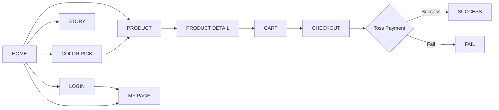

# 🖊️ MONAMI 153 — Color Your Day

> 익숙한 모나미 153을 ‘컬러로 취향을 탐색하고 구매하는 경험’으로 재구성한 반응형 웹 프로젝트

<p>
  
  
  
  
  
  
</p>

## 🖼️ Demo

- **Live Demo:** https://monami153-coral.vercel.app/
- **GitHub Repository:** https://github.com/hrjang95-code/monami153

> README는 제출용 ZIP의 실제 소스 코드를 기준으로 작성했습니다. 데모 서버의 상태나 외부 인증 설정은 시점에 따라 달라질 수 있습니다.

---

## 📌 Project Overview

MONAMI 153은 모나미의 대표 볼펜 **153**을 주제로 제작한 웹 퍼블리셔 포트폴리오 프로젝트입니다. 제품을 단순히 나열하는 쇼핑몰 형태보다, 153의 브랜드 이미지와 다양한 컬러를 함께 경험할 수 있도록 홈 · 제품 · 컬러 탐색 · 상세 · 장바구니 · 주문/결제 · 로그인/마이페이지 흐름을 하나의 웹 경험으로 구성했습니다.

데스크톱에서는 왼쪽에 브랜드 쇼케이스를 두고 오른쪽에 모바일 앱 형태의 콘텐츠를 배치하며, 화면 폭이 작아지면 브랜드 영역을 숨기고 앱 UI를 전체 화면으로 전환합니다. CSS 기준 `1100px` 이하에서 모바일 중심 레이아웃으로 변경되고, `375px` 이하에 대한 추가 조정도 포함되어 있습니다.

| 항목 | 내용 |
|---|---|
| 프로젝트명 | MONAMI 153 — Color Your Day |
| 유형 | 반응형 Web / Web App UI |
| 작업자 | 장혜리 |
| 역할 | UI 구성, 웹 퍼블리싱, JavaScript 인터랙션 및 기능 구현 |
| 주요 페이지 | Home, Product, Color, Detail, Cart, Checkout, Login, My Page, Story |
| 데이터 저장 | `localStorage` 기반 장바구니·로그인 상태 + Firebase Authentication |
| 결제 | Toss Payments JavaScript SDK 테스트 결제 요청 |
| 배포 | Vercel |

---

## ✨ 주요 기능 & 인터랙션

### 1. 반응형 브랜드 쇼케이스 + 모바일 앱 UI
- 데스크톱에서는 **브랜드 소개 영역 + 모바일 앱 프리뷰**를 한 화면에 배치합니다.
- `@media (max-width: 1100px)`에서 브랜드 영역을 숨기고 `.app`을 `100vw × 100vh`로 전환합니다.
- 모바일 화면에는 상단 헤더와 HOME / PRODUCT / COLOR / MY 하단 내비게이션을 유지해 앱과 비슷한 탐색 경험을 구성했습니다.

### 2. 상품 탐색 및 필터링
- PRODUCT 페이지에서 카테고리 탭을 선택하면 `data-filter` 기준으로 상품을 필터링합니다.
- URL의 `category`, `color` query parameter를 읽어 선택 상태를 반영합니다.
- COLOR 페이지에서는 시리즈와 컬러를 선택한 뒤 해당 조건을 PRODUCT 페이지로 전달할 수 있도록 구현했습니다.
- 상품 카드의 체크/하트 상태, 수량 조절 등은 JavaScript 이벤트로 처리합니다.

### 3. 상품 상세 · 컬러 선택 · 장바구니
- DETAIL 페이지에서 Signature Black / Red / Blue / Green 컬러 선택 상태를 관리합니다.
- 선택 컬러와 수량을 장바구니 데이터에 반영하고, 같은 상품이 이미 있으면 수량을 합산합니다.
- 장바구니 데이터는 `localStorage`의 `monami153_cart`에 JSON 형태로 저장하여 페이지 이동 후에도 유지합니다.
- 최대 재고 수량을 넘기면 토스트 메시지를 표시하며, 장바구니의 총 수량과 총 금액을 다시 계산합니다.

### 4. Drawer Menu
- 햄버거 버튼을 누르면 앱 내부에 사이드 Drawer가 열립니다.
- HOME / PRODUCT / COLOR PICK / CART / MY 153 / ABOUT 153 메뉴로 이동할 수 있습니다.
- Overlay 클릭, 닫기 버튼, `Esc` 키로 Drawer를 닫을 수 있습니다.

### 5. 로그인 상태 연동
- Google 로그인은 **Firebase Authentication + GoogleAuthProvider + `signInWithPopup()`** 방식으로 연결되어 있습니다.
- 로그인 사용자 정보는 공통 `currentUser` 객체로 정리하고 `localStorage`에도 저장해 로그인 화면, 마이페이지, Drawer의 UI 상태를 함께 갱신합니다.
- Firebase의 `onAuthStateChanged()`로 새로고침 후 Google 인증 상태를 다시 확인합니다.
- Kakao는 SDK 인가 요청과 callback 페이지가 존재하지만, 서버가 없는 정적 프로젝트 특성상 callback에서 실제 토큰 교환까지 처리하지 않고 임시 사용자 상태를 생성하는 구조입니다.
- Apple / 이메일 로그인 / 회원가입 버튼은 UI에는 존재하지만 현재 제출 소스에는 실제 인증 이벤트가 연결되어 있지 않습니다.

### 6. Toss Payments 테스트 결제 요청
- CHECKOUT 페이지에서 Toss Payments JavaScript SDK를 불러옵니다.
- 화면의 총 결제 금액과 상품명을 읽어 `requestPayment('카드', ...)`를 호출합니다.
- 주문마다 timestamp와 random string을 조합해 `orderId`를 생성합니다.
- 성공/실패 URL을 현재 origin 기준 `success.html`, `fail.html`로 전달합니다.
- `success.html`은 URL query parameter의 `orderId`, `amount`, `paymentKey`를 화면에 표시합니다.

> **구현 범위 참고:** 현재 소스에는 별도 서버에서 Toss Payments 결제 승인을 호출하는 로직이 없습니다. 따라서 README에서는 “테스트 결제 요청 UI/흐름 구현” 범위로 설명합니다.

### 7. 브랜드 인터랙션
- 153 STORY, COLOR PICK, GIFT SHOP 카드에 hover/loop 애니메이션을 적용했습니다.
- 브랜드 소개 문구는 글자별 `animation-delay`를 이용한 reveal 효과를 사용합니다.
- `prefers-reduced-motion: reduce` 환경에서는 주요 애니메이션과 transition을 제거하도록 처리했습니다.

---

## 🧭 User Flow



대표 구매 흐름은 **HOME → PRODUCT/COLOR → DETAIL → CART → CHECKOUT → 결제 결과** 순서입니다. 인증 기능은 LOGIN에서 Google 또는 Kakao 흐름으로 진입하며 로그인 상태가 MY PAGE와 Drawer에 반영됩니다.

---

## 🗂️ 실제 Folder Structure

아래 구조는 제출된 MONAMI ZIP 내부의 실제 프로젝트 폴더를 기준으로 정리했습니다.

```text
MONAMI153/
├── index.html              # 홈 / 브랜드 쇼케이스
├── product.html            # 상품 목록 및 필터
├── color.html              # 컬러 탐색
├── detail.html             # 상품 상세 / 컬러 선택 / 장바구니 담기
├── cart.html               # 장바구니
├── checkout.html           # 주문 정보 / Toss Payments 결제 요청
├── success.html            # 결제 성공 결과 표시
├── fail.html               # 결제 실패 화면
├── login.html              # 로그인 UI
├── kakao-callback.html     # Kakao 인가 callback 처리
├── mypage.html             # 로그인 상태 기반 마이페이지
├── story.html              # MONAMI 153 브랜드 스토리
├── style.css               # 전체 페이지 공통 및 반응형 스타일
├── script.js               # 공통 인터랙션 / 인증 / 장바구니 / 필터
├── add_dates.js            # 프로젝트 보조 스크립트
├── update_active.js        # 프로젝트 보조 스크립트
├── parse_css.js            # 프로젝트 보조 스크립트
├── img/                    # 실제 사용 이미지 에셋
├── backup/                 # 일부 페이지 백업본
├── clean/                  # 일부 페이지 정리본
└── README.md               # 기존 프로젝트 메모 README
```

> ZIP에는 `.git/`과 별도 백업 ZIP도 포함되어 있지만, 위 구조에서는 실제 웹 실행과 유지보수에 직접 관련된 항목을 중심으로 표시했습니다.

---

## 🛠️ Tech Stack

| 구분 | 기술 | 실제 사용 내용 |
|---|---|---|
| Markup | HTML5 | 페이지별 시맨틱 구조, 링크/버튼 기반 화면 이동 |
| Styling | CSS3 | Grid/Flex 레이아웃, 반응형 Media Query, transition/keyframes |
| Interaction | Vanilla JavaScript | Drawer, 필터, 하트, 수량, 장바구니, URL parameter 처리 |
| Storage | Web Storage API | `localStorage`에 장바구니와 사용자 상태 저장 |
| Authentication | Firebase Authentication | Google popup 로그인, 인증 상태 감지, 로그아웃 |
| Social Login | Kakao JavaScript SDK | 인가 요청 및 callback 흐름 구성 |
| Payment | Toss Payments JS SDK v1 | 카드 테스트 결제창 요청, success/fail URL 연결 |
| Font | Google Fonts | Manrope, Gowun Dodum, Nanum Pen Script, Kalam |
| Deployment | Vercel | 정적 웹 프로젝트 배포 |
| Version Control | Git / GitHub | 프로젝트 버전 관리 및 원격 저장소 운영 |

---

## 🤖 AI 활용 프로세스

이 프로젝트에서는 AI를 결과물을 그대로 사용하는 도구가 아니라, **디자인 아이디어를 코드로 구체화하고 반복 수정하는 보조 도구**로 활용했습니다. 최종 구조와 동작은 실제 브라우저 화면과 소스 코드를 확인하면서 직접 조정하는 방식으로 진행했습니다.

### ① 화면 구조 구체화
브랜드 쇼케이스와 모바일 앱 UI가 동시에 보이는 레이아웃을 자연어로 설명하고 HTML/CSS 구조의 초안을 만든 뒤, 실제 화면 비율과 여백을 직접 수정했습니다.

### ② 인터랙션 구현 보조
Drawer, 상품 필터, 컬러 선택, 장바구니 수량 처리처럼 반복적인 JavaScript 로직은 원하는 동작을 단계별로 설명해 초안을 만들고, 기존 DOM 구조에 맞게 selector와 이벤트를 조정했습니다.

### ③ 외부 SDK 연동 점검
Firebase Authentication, Kakao SDK, Toss Payments처럼 설정값과 callback 흐름이 필요한 기능은 에러 메시지와 현재 코드를 함께 확인하면서 연결 방식을 점검했습니다.

### ④ 디버깅 및 UI 미세조정
반응형에서 레이아웃이 깨지거나 인터랙션이 의도와 다르게 동작할 때, 증상과 관련 코드를 기준으로 원인 후보를 좁힌 뒤 CSS breakpoint, 상태 저장, URL 처리 등을 수정했습니다.

### AI Prompt Example

실제 작업에서 사용할 수 있는 형태의 프롬프트 예시는 다음과 같습니다.

> "현재 프로젝트는 HTML/CSS/Vanilla JavaScript로 만든 MONAMI 153 반응형 웹이야. 기존 디자인과 클래스명은 최대한 유지해줘. `detail.html`에서 사용자가 선택한 펜 컬러와 수량을 `localStorage` 장바구니에 저장하고, 같은 컬러 상품이 이미 있으면 새 항목을 만들지 말고 수량만 증가시키고 싶어. 재고는 10개를 넘지 않게 하고, 초과하면 토스트 메시지를 보여줘. `script.js`의 기존 `cartItems`, `saveCartToStorage()`, `updateCartBadge()` 구조를 먼저 확인한 뒤 필요한 부분만 수정해줘. 수정한 코드와 수정 이유를 함께 알려줘."

이처럼 **기존 코드 구조, 변경 범위, 유지할 요소, 원하는 동작**을 구체적으로 전달해 불필요한 전체 재작성을 줄이는 방식으로 AI를 활용했습니다.

---

## 🩹 Troubleshooting

| Issue | Cause | Solution |
|---|---|---|
| 페이지를 이동하면 장바구니 상태가 사라짐 | 초기 장바구니가 JavaScript 메모리에만 존재하면 페이지 로드 시 초기화됨 | `monami153_cart` 키로 `localStorage`에 JSON 저장하고 시작 시 다시 파싱하도록 구성 |
| Google 로그인 후 새로고침 시 화면 상태 동기화 필요 | DOM의 로그인 UI와 Firebase 세션 상태를 별도로 관리해야 함 | `onAuthStateChanged()`로 인증 사용자를 확인하고 공통 `currentUser` 객체, 로그인 화면, 마이페이지, Drawer를 함께 다시 렌더링 |
| 정적 사이트에서 Kakao callback 후 사용자 토큰 처리가 완결되지 않음 | 인가 코드 → access token 교환 단계는 client secret 보호가 가능한 서버 구성이 필요한데 프로젝트가 정적 프론트엔드 구조임 | callback 수신 구조까지만 구성하고, 현재 구현에서는 임시 사용자 상태를 `localStorage`에 저장하도록 범위를 제한. 실제 서비스에서는 서버/백엔드 기반 토큰 교환이 추가로 필요함 |
| Vercel 등 배포 환경에서 결제 성공/실패 URL을 고정 localhost로 둘 수 없음 | 개발 주소와 배포 origin이 서로 다름 | `window.location.origin`을 기준으로 `success.html`, `fail.html` URL을 동적으로 생성 |
| 장바구니 수량이 재고보다 커질 수 있음 | `+` 버튼과 상세페이지 담기 로직에 상한 검증이 없으면 계속 증가 가능 | 상품별 `stock` 값을 두고 증가 전 비교, 초과 시 `showStockFeedback()` 토스트 출력 |
| 모바일에서 데스크톱용 브랜드 영역이 화면을 차지함 | 데스크톱 2영역 레이아웃을 그대로 유지하면 작은 화면에서 콘텐츠 폭이 부족함 | `1100px` 이하에서 `.brand`를 숨기고 `.app`을 viewport 전체 크기로 전환 |

---

## 💡 What I Learned

- 여러 HTML 페이지가 하나의 서비스처럼 동작하려면 **공통 상태와 이동 흐름을 먼저 설계하는 것이 중요**하다는 점을 배웠습니다.
- Vanilla JavaScript만으로도 URL parameter, DOM state, `localStorage`를 조합해 상품 탐색과 장바구니 같은 기본적인 쇼핑 흐름을 만들 수 있었습니다.
- Firebase나 결제 SDK를 붙일 때는 화면 구현뿐 아니라 **redirect URI, 배포 origin, 인증 상태 복원, 서버가 필요한 영역**을 구분해야 한다는 점을 경험했습니다.
- 반응형 작업에서는 단순히 요소 크기를 줄이는 것보다, 데스크톱과 모바일에서 **정보의 우선순위와 레이아웃 자체를 다르게 설계**하는 것이 더 효과적이었습니다.
- AI로 코드 초안을 빠르게 만들 수 있지만, 기존 클래스 구조와 실제 실행 결과를 확인하지 않으면 중복 코드나 동작 불일치가 생길 수 있어 **직접 검증하고 수정하는 과정이 필수**라는 점을 배웠습니다.

---

## 📄 License

본 프로젝트는 **웹 퍼블리셔 포트폴리오 및 학습 목적의 개인 프로젝트**입니다.

MONAMI 및 MONAMI 153의 상표, 로고, 제품 이미지 등 원 브랜드 관련 권리는 각 권리자에게 있습니다. 본 프로젝트는 공식 MONAMI 서비스가 아니며 상업적 판매를 목적으로 하지 않습니다.

프로젝트에서 직접 작성한 HTML/CSS/JavaScript 코드는 포트폴리오 열람을 위한 용도로 공개합니다. 브랜드 에셋의 재배포 및 상업적 사용은 허용하지 않습니다.

---

**Created by 장혜리 · Web Publisher Portfolio Project**
